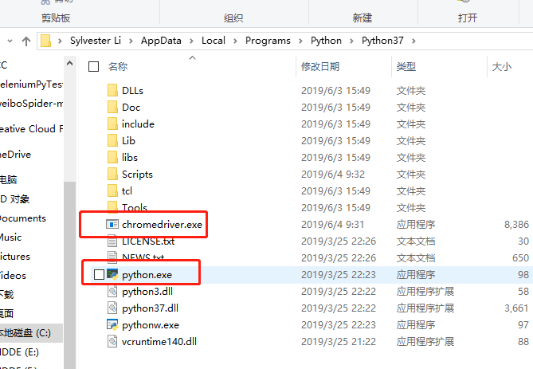

# SeleniumPyTest

## 非正式使用指南

### 环境安装

#### 安装python

访问：

> [下载页面](https://www.python.org/downloads)

> [Windows直达](https://www.python.org/downloads/windows/)

**安装记得点上注册到Path！！**

#### 安装pip

Python 3.4+ 以上版本都自带 pip 工具

#### 下载Chrome Driver

如果你没有Google Chrome那就装一个，装完后**再**下对应版本的[Chrome Driver](https://npm.taobao.org/mirrors/chromedriver/)

将Chrome Driver.exe放在Python安装目录下



#### 安装Selenium

输入 ```pip install selenium ``` 通过pip安装Selenium(抓阅读量用)

#### 安装lxml(俩都是L)

输入 ``` pip install lxml ``` (抓内容、转评赞用)

(如果还缺啥那就```pip install ```安装就完事儿了)

## 不主动、不拒绝、不负责声明

如果有啥bug我也不负责，反正就随便写的。
要说有什么可以Update的地方，那就是再把xpath学习一手让TestUnit.py直接抓取所有内容，输出到.xls中

### 接着开始跑用例

在PowerShell或者其他Terminal中输入```py 程序名儿.py ```就可以运行程序了

- 用例weiboSpider.py（可扒取发布时间、机型、地点、博文、转评赞数量）
- 用例 TestUnit.py 是我自己写来扒阅读量的，最后会生成一个.xls文件

想必看到这里你已经懂了，数据合并还是得手动。但是这已经减少90%的工作量了！知足了！有兴趣的话你再修改。**欢迎pr**！

#### TestUnit01_py

这个用来抓阅读量。

运行之后，扫描二维码。然后全自动抓下来，生成Excel表格。

要抓哪一页就改```pageIndex```然后看到Terminal有个``` <<<<< done >>>> ``` 就去文件夹下找到名为**微博数据-2019xxxx**的Excel文件。

> 如果不想要``` 阅读量 ```三个字，请使用=RIGHT(A1,LEN(A1)-3)

*注意：A1为A1单元格，3为你要删除前3个字符*
s
> 具体参考：
> * [百度经验1](https://zhidao.baidu.com/question/1958970110213396180.html)
> * [百度经验2](https://baijiahao.baidu.com/s?id=1619256193144309159)
> * [百度经验3](https://jingyan.baidu.com/article/0eb457e5c5a99603f0a90510.html)

#### weiboSpider_py

这个用来抓大部分的内容，最后会生成一个csv，也可以用Excel打开，然后手动合并一下数据。

你需要修改weiboSpider.py中几项参数。

1. cookie
2. user_id
3. filter

先登录<https://passport.weibo.cn/signin/login>,然后在地址栏输入<https://weibo.cn>。


F12点击"Headers"，其中"Request Headers"下，"Cookie"后的值即为我们要找的cookie值取出cookie。


具体操作见原[作者GitHub](https://github.com/dataabc/weibospider)

*注意：每99条保存一次csv，如果不想爬了直接关闭终端*

### [webScpTest01.py](https://github.com/SylvesterLi/SeleniumPyTest)
*  基础测试
*  https://www.bilibili.com/video/av19057145/?p=13
*  https://selenium-python-zh.readthedocs.io/en/latest/getting-started.html
*  [python爬虫从入门到放弃（八）之 Selenium库的使用](https://www.cnblogs.com/zhaof/p/6953241.html)

### 微博相关资料统计
- 使用m.weibo.cn古老网页抓取教程[weiboSpider.py](https://github.com/dataabc/weiboSpider/blob/master/weiboSpider.py)
- [xpath的使用](https://www.cnblogs.com/lei0213/p/7506130.html)

###  Notice
-  我的Chrome版本为74
-  Chrome Driver忘记了.下载网址为http://chromedriver.storage.googleapis.com/index.html
- 除weiboSpider.py版权归原开发者所有，本Repo所有代码CC0，随意使用。（如果用的上的话，笑）
