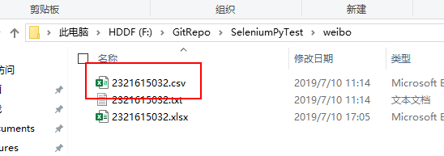
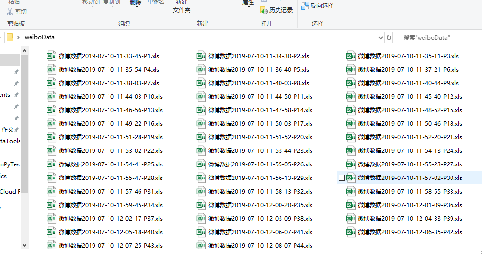

# 我们要什么数据

微博共需要拿到：

- 日期
- 全团排名
- 序号
- 文案
- 阅读数
- 转发
- 评论

# 选用什么方法

Github上有很多可以抄的代码，大家都在用Python爬微博，为了方便，本次用Python。


> Selenium是一个自动化测试工具，说白了就是可以模拟你鼠标键盘，帮你在浏览器里输入、点击、复制粘贴。

所以本案例使用Python + Selenium 

其他的什么Scrapy都不说了，为了简单方便好借鉴就用Python + Selenium。

Github上有个项目可以直接抓

> 见 [https://github.com/dataabc/weiboSpider](https://github.com/dataabc/weiboSpider)

- 日期时间 √
- 文案 √
- 转发数 √
- 评论数 √
- 点赞数 √
- 来源型号 √
- 图片（可选，本次不抓） √

剩下的咱们只用抓**阅读数**就可以了

序号自己编，全团排名就30个（为这两项数据再写个程序划不来）

接下来先讲怎么跑第一个程序，抓取日期时间、文案、转评赞

# 起飞前的准备

+ 安装Python开发环境

    访问：

    > [点这下载](https://www.python.org/downloads)

    > [点这儿 直达Windows下载页面](https://www.python.org/downloads/windows/)

    **安装记得点上注册到Path！！**

    

+ 安装pip

    Python 3.4+ 以上版本都自带pip，这里咱下最新的Python就可以忽略这一项。

+ 下载Chrome Driver

    > 如果你没有Google Chrome那就装一个，装完后**再**下对应版本的 [Chrome Driver](https://npm.taobao.org/mirrors/chromedriver/) ，并将Chrome Driver.exe放在Python安装目录下。

    

+ 安装Selenium

    > 输入 ```pip install selenium ``` 通过pip安装Selenium(抓阅读量用)

+ 安装lxml(俩都是L)

    > 输入 ``` pip install lxml ``` (抓内容、转评赞用)

+ 安装xlwt

    > 输入 ``` pip install xlwt ``` (将数据存入Excel表格)

(如果程序跑起来报错说还缺啥那就```pip install ```安装就完事儿了)

# 抓取主要数据

> 如果你感觉上面已经很繁琐了，那就趁早关闭该页面吧。剩下才是主要的工作。

#### 设置cookie和user_id

1. 用Chrome打开 https://passport.weibo.cn/signin/login

2. 输入微博的用户名、密码，登录，如图所示

    

    登录成功后会跳转到https://m.weibo.cn

3. 按F12键打开Chrome开发者工具，在地址栏输入并跳转到https://weibo.cn，跳转后会显示如下类似界面

    

4. 依此点击Chrome开发者工具中的Network->Name中的weibo.cn->Headers->Request Headers，"Cookie:"后的值即为我们要找的cookie值，复制即可，如图所示：

    


5. 按图找到UserId并填写在```weiboSpider.py ```中

    

6. 使用文本编辑器打开```weiboSpider.py ```，粘贴cookie值

    

更多设置选项（例如抓图）可以查看原Repo(https://github.com/dataabc/weiboSpider)

#### 运行程序 查收数据

7. 在项目文件夹中打开PowerShell

    

8. 在PowerShell中输入py weiboSpider.py运行程序

    

    每抓取一百条微博储存一次数据，所以不想抓了就等这个一百存完了关闭程序即可。（注意翻记录）

    文件以csv的格式存储在weibo文件夹下
    
    

# 抓取阅读量

直接在PowerShell中输入```py Test01.py```就可以看到浏览器被打开，此时打开手机扫描二维码，登录微博


然后看着网页是不是像有人在操作一样，自己滚动、自己点击下一页，喝杯咖啡，等一会数据就爬下来了。

OK，此时有一个关键点请注意。程序爬的是```公开```的```原创微博``` 的阅读量，至于```转发的```、```仅对自己可见```的微博没有做过校对。

存下来的数据放在结尾为Px的Excel中(x为第几页的页数)


PS：因为是每一页写入一次Excel数据，所以也是不想爬了直接关掉程序即可。（也可直接在PowerShell中按Ctrl+C）

# 数据核对、整合

整下来分别是：

阅读量（微博数据-时间-Px.xls）：


文案等数据（UserId.csv 使用Excel打开即可）：


俩工具爬下来的微博都是按时间轴顺序排列。但是需要核对的阅读量有没有错位。建议每隔45条核对一条阅读量，防止出错。错位了就网上找找是不是有非原创的微博。找找问题，把数据对位排好。

再后面就是表格数据的整理。圈选数据，Ctrl+H替换掉“阅读 ”


如此多的表格怎么处理呢？



可以打开```excelMerge.py```找到```location="C://Users/SANG-ASUS/Desktop/weiboData"``` 将location设置为（把后面的地址设置为）你的表格文件夹

# 是不是很简单呢？